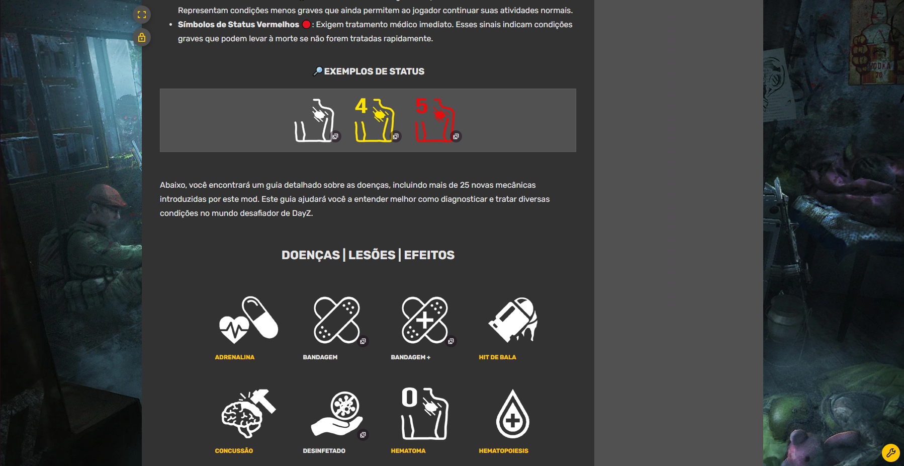

# 🎮 Sobre o Projeto / Hobbie 
Este é um projeto / hobbie pessoal que reflete minha paixão por um dos jogos que mais admiro: DayZ.  
Ao longo de 4 anos, desenvolvi diversos projetos, servidores e mods relacionados ao jogo, sempre buscando aprimorar a experiência de outros jogadores. 
Agora, dedico-me à criação de uma **wiki detalhada e em português** para o **Syberia Project**, um dos mods mais complexos e imersivos já criados para DayZ e atualmente tem 29 páginas.

### 📌 Como acessar a WikiStabz?  

Acesse a **WikiStabz** para aprender tudo sobre as mecânicas, habilidades e dicas de sobrevivência do Syberia Project. Este projeto foi criado para ajudar a comunidade e facilitar o entendimento do mod.  

🔗 [WikiStabz](https://wikistabz.fandom.com/pt-br/wiki/DayZ_Syberia_Wiki)  <- Acesse 🤗

---

### Página | Principal 📑

### Página | Doenças 📑

---
# Descrição Detalhadas Sobre o Projeto

### 🌐 WikiStabz: A Wiki do Syberia Project para DayZ

Bem-vindo à **WikiStabz**, a wiki dedicada ao **Syberia Project**, um mod revolucionário para o jogo **DayZ**. Esta wiki busca ser a fonte de informações para jogadores que desejam explorar e dominar o universo pós-apocalíptico do mod.

---
## 🛠️ O que é o Syberia Project?  

O **Syberia Project** é um mod em desenvolvimento para o jogo **DayZ** que transforma a experiência de sobrevivência em um **MMORPG complexo e imersivo**. Ele traz mecânicas detalhadas e desafiadoras, incluindo:  
- **Sistema de habilidades** que evoluem com a experiência do jogador.  
- **Medicina realista**, com remédios específicos para diferentes doenças.  
- **IA de zumbis aprimorada** e jogabilidade mais profunda e realista.  

---

## 🩺 Mecânicas de Medicina  

No **Syberia Project**, a medicina é dividida em três categorias, cada uma com funções e métodos de uso distintos:  

### 💊 **Comprimidos**  
- Usados para tratar **estágios iniciais de doenças** ou para prevenção.  
- Cada embalagem contém **10 comprimidos**.  
- **Combine** embalagens iguais para economizar espaço no inventário.  

### 🧪 **Ampolas**  
- Contêm medicamentos para **doenças complexas ou avançadas**.  
- Cada ampola permite **3 injeções**.  
- É necessário **desinfetar a seringa** após cada uso.  

### 💉 **Injetores**  
- Possuem a mesma função das ampolas, mas são **descartáveis** e não exigem seringas.  

---

## 🎮 Sistema de Habilidades  

O **Syberia Project** apresenta um sistema robusto de habilidades, transformando o DayZ em um verdadeiro **MMORPG**. Atualmente, existem **7 habilidades principais**:  

- 🛡️ **Imunidade (Immunity)**  
- 💉 **Medicina (Medicine)**  
- 🏃‍♂️ **Atletismo (Athletics)**  
- 💪 **Força (Strength)**  
- 🕵️‍♂️ **Furtividade (Stealth)**  
- 🔥 **Sobrevivência (Survival)**  
- 🏹 **Caça (Hunting)**  

⚡ **Dica:** Evolua essas habilidades para se tornar um sobrevivente implacável no mundo pós-apocalíptico.  

---

## 🧭 Sobrevivência  

No início, seu personagem será frágil e vulnerável, enfrentando dificuldades até mesmo contra os desafios mais básicos.  

### 🌟 **Evolução**  
- Com o tempo e o aumento de habilidades, seu personagem se tornará mais forte, capaz de enfrentar as adversidades do mundo do Syberia Project.  

### 📘 **Dicas e Estratégias**  
- Consulte nossa seção de dicas para estratégias que irão ajudá-lo a **sobreviver** e **maximizar suas habilidades** no universo Syberia.  

---

## 🚀 Sobre   

A WikiStabz foi criada com o objetivo de unir informações sobre o Syberia Project e ajudar jogadores a dominar o mod. Este projeto é atualizado regularmente para refletir as mudanças no jogo.  

📬 **Contato:** [med.rodrigo97@gmail.com]  
🌐 **GitHub:** [[dev-medeiros](https://github.com/dev-medeiros)]  

---
